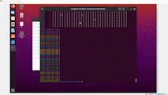

# cs5113fa21-fproj
Tyler Julian

The project implements asynchronous chess. Each chess piece is a client that connects to the board (server). Each piece makes a move independently of each other piece without a set turn order. You can read more on the project description [here](https://oudatalab.com/cs5113fa21/projects/project). 

There is no turn timer and no turn order, so each piece is constantly making new moves until a checkmate is determined. Since a check isn't a guaranteed loss using normal chess rules, I have determined that the game is over when the king is taken. 

## Here is a quick overview of the project. 
- The chess board is 32 x 32, but the pieces are located normally in their respective spots. (This can be easily changed)
- Each chess piece on the board is a player (client) that connects to the board (server)
- There is no turn order and each piece makes a move independent of the other pieces. The piece then sends its proposed move to the server. 
- The server puts the move request on the queue and then processes the first move request on the queue.
- Once the request is processed, the server determines if the move is legal then replies back with an acknowledge message.
- The acknowledge message tells the player (client) if their piece was moved or not. 
- The client then detemines its state from the acknowledge mesaage and updates its eternal state.
- Each client will continue to make moves until one of the following happens.
    - The game is over due to a checkmate (A king is taken)
    - The client is taken
    - The client has no legal moves. (It will wait until there is a legal move.)

## Primary focus
The primary focus of the project was to create a chess game where each piece was independent of each other. For this game, I changed the rules around checkmate and I removed the rule that you cannot pass through allied pieces. The intended rules can be added back later, but were not implemented due to processing limitations of the virtual machine.

The main focus was to implement it a way similar to that of a game. The battle royale genre was my inspiration. Each piece joins the game (server/board). The game waits until 32 players have joined (Needs enough players to start). The game then starts and every player goes at it. I wanted the server to control and maintain every aspect of the game.

To acheive this, The main purpose of the client is to connect to the server and to make moves. The game then keeps track of everything serverside. This provides the clients with only the information they need to know. You can think of the lack of knowledge on the players behalf as fog of war. The server determines if a move is legal. If the move is legal then the move is allowed then the client updates their state on their side. My implementation is similar to that of a game server. This implementation style helps reduce the impact of 'hackers' trying to make illegal moves. An example of a illegal move is that of player trying to move a piece before the game starts or them making a move that is impossible with their current piece (I.E a rook making a diagonal move).

## Distributed Systems problems
The following list are some of the problems I had to overcome during the development. 

### Scalability
Scalability was one of my biggest concerns. My implementation allows the game to have up to x amount of number of pieces of a particular color and to have a board that can be any n x n size. (n is the size of the board. My examples and demo use a 32x32 board and x = n * n)

### Malicious clients (security / failure handling)
One of my bigger concerns during development is that of a malicious client. I define a malicious client as: A client that is making illegal moves or trying to obtain illegal information.

To get around malicious clients. I have the server maintain the board state and determine if a move is illegal. There are also no functions/requests that allows a client to obtain illegal info.

### naming
Naming was and continues to be an issue with this implementation. The name of each client is unique to that piece's starting position. One of the way to get around of multiple clients having the same name is rejecting the duplication names from joining the server. In my implemenation of achess, my names are inherently unique, so the system is thrown out of wack if a name is used twice. The starting location, type of piece, and color is determined using the clientname. The issues arise from us trying to set up pieces on the same location at the beginning. 

## Testing. 
The scalability of the implementation allows me to test the functionality of the pieces, win conditions, and to recreate errors. For example, you can run the server and only have 2 clients connect, the kings. You can watch the clients move correctly and catch any errors. 

You can also slow down the clients using waits to see the exact moves that the clients are making. This type of testing ensures that the clients are making non illegal moves and if they are making illegal moves, then the illegal moves are rejected. 

A smaller board can be used as well to ensure that each of the pieces are functioning correctly. The major aspect to test using this method is to make sure pieces aren't moving out of bounds or that pieces are capturing other pieces correctly.

# Implementation tools
The following technologies were used in my implementation. 
    - Python
        -Numpy, The board is stored as a 32x32 array
        -random, The moves are not determined by an AI. The moves are randomly determined.
        -socket, get hostname of the clients (usernames of players)
        -time, This is used for the 10 hz refresh rate of the game board.
        -grpc, see above for the grpc uses.
    - [Docker](https://www.docker.com/) , Docker was used to launch the 32 clients and the server.
    - [gRPC](https://www.grpc.io/docs/what-is-grpc/introduction/), gRPC handled the queue and the messages between the client and server.
    - [protocol buffers](https://developers.google.com/protocol-buffers), Protocol buffers provided the messages sent between the server and client.

The project can be ran by running the startup.bash file in the src folder. 

# Links
The project infomercial video can be found here. Click on the thumbnail.

The demo can be found here. Click on the thumbnail.

